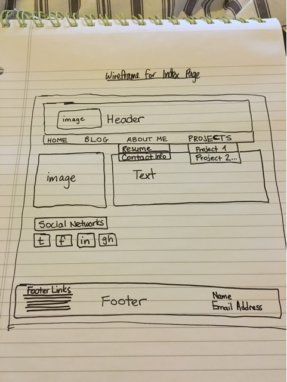
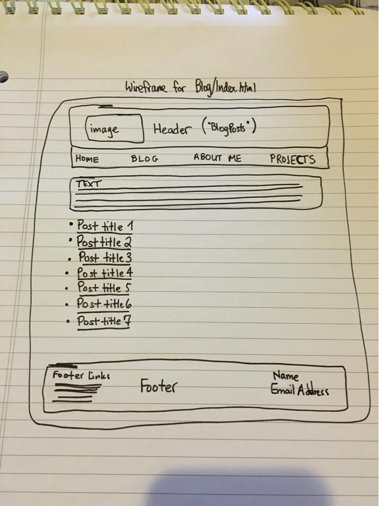

What is a wireframe?
A wireframe is a diagrammatic mockup of a webpage.
What are the benefits of wireframing?
Wireframes allow designers to plan out the layout and user interaction of a website without the distractions of content, and allow designers to determine how users will interact with the interface.
Did you enjoy wireframing your site?
I enjoyed wireframing my site and saw it as a useful first step in translating ideas in my head to concrete products.
Did you revise your wireframe or stick with your first idea?
I had a vague framework in my head for how I wanted the wireframe to look before I put it to paper. When I started to draw the wireframe, I realized that some of my ideas for how it should look (for example, putting blog post titles on the right side) were contrary to principles of good UX design, and as such revised them.
What questions did you ask during this challenge? What resources did you find to help you answer them?
I had a lot of questions about what sorts of information should be included on a wireframe, especially regarding how simple a wireframe should be/how much content should appear on it. I used the Beginner's Guide to Wireframing and the Wirify tool to help me answer these questions and create a wireframe design.
Which parts of the challenge did you enjoy and which parts did you find tedious?
I found some of the resources on wireframing a little tedious to read (that potential for rabbit-holing really is there!) but I found the actual process of making wireframe designs quite enjoyable.