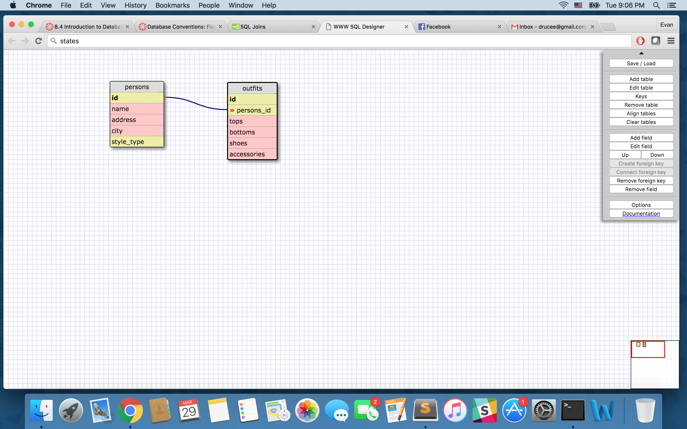

1. SELECT * FROM states;
2. SELECT * FROM regions;
3. SELECT state_name,population FROM states;
4. SELECT state_name, population
	FROM states
	ORDER BY population DESC;
5. SELECT state_name
	FROM states
	WHERE region_id=7;
6. SELECT state_name,population_density
	FROM states
	WHERE population_density>50
	ORDER BY population_density ASC;
7. SELECT state_name
	FROM states
	WHERE population BETWEEN 1000000 AND 1500000;
8. SELECT state_name, region_id FROM states
	ORDER BY region_id ASC;
9. SELECT region_name FROM regions
	WHERE region_name LIKE '%central%';
10. SELECT regions.region_name, states.state_name
	FROM regions
	INNER JOIN states
	ON regions.id=states.region_id;

Outfit Picker Schema: 

What are databases for?
Databases are used for organizing and storing data so that it can be easily accessed and updated.
What is a one-to-many relationship?
A one-to-many relationship is where one row in one table can refer to many rows in a related table.
What is a primary key? What is a foreign key? How can you determine which is which?
A primary key is an identifier in a database that is unique for each record; some examples of this may include a VIN number or SSN. A foreign key is an identifier in a database that uniquely identifies a row of another table. For example, a primary key such as employee_id is created in one table, and then is referenced in a second table, employee_details, as a foreign key.
How can you select information out of a SQL database? What are some general guidelines for that?
Selecting information from an SQL database is done by commands. The basic syntax for those commands is as follows: SELECT column FROM table_name.

